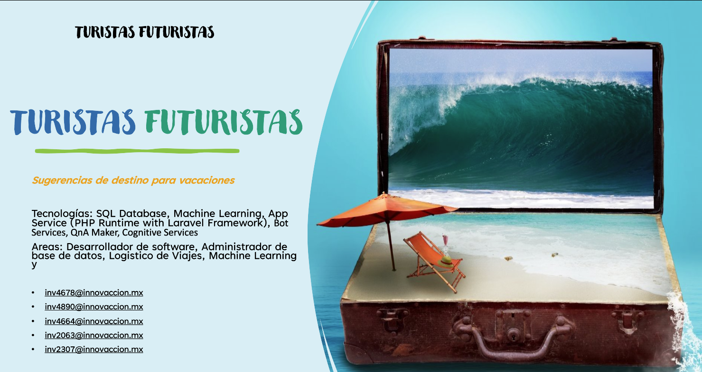
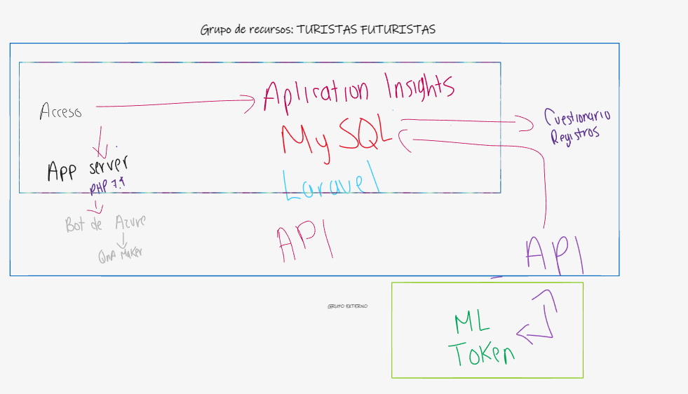
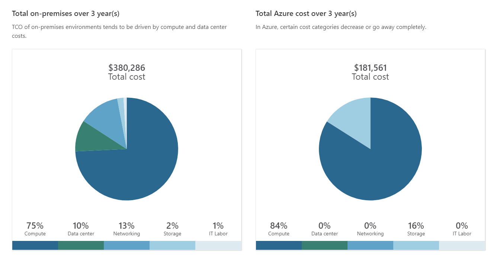
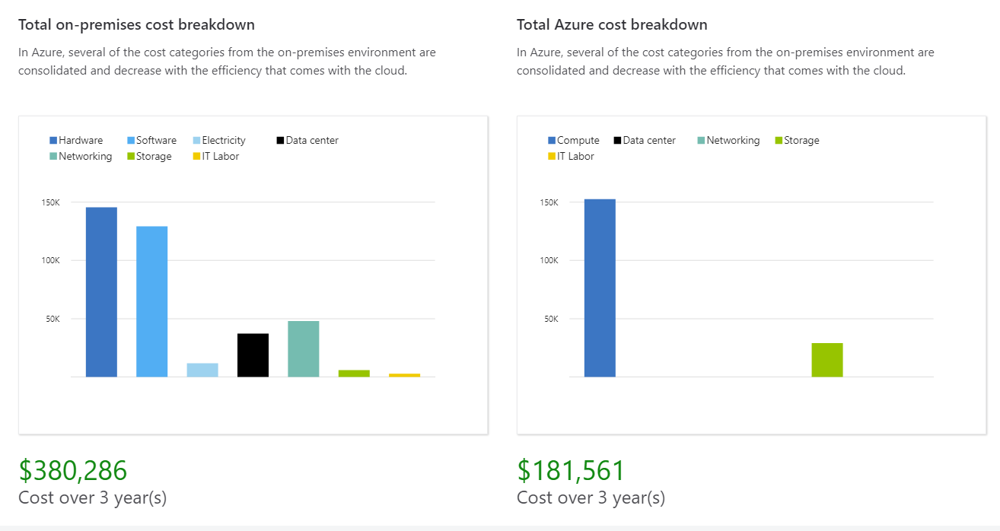

# Sugerencias de destino para vacaciones

### Descripción del Proyecto a Entregar (Corta)
Tecnologías: SQL Database, Machine Learning, App Service (PHP Runtime with Laravel Framework), Bot Services, QnA Maker, Cognitive Services​

Areas: Desarrollador de software, Administrador de base de datos, Logistico de Viajes, Machine Learning
### Link al Tiktok
[Clic Aqui](https://vm.tiktok.com/ZM83DCTNX/)
### Diagrama de Azure

### SLA Compuesto

### TCO 3 años y Precio Total por mes

[PDF_TOTAL COST](img/total_cost.pdf)

### Tiempo sin disponibilidad a un año

### Qué te pareció el evento

## Integrantes
inv4678@innovaccion.mx

inv4890@innovaccion.mx

inv4664@innovaccion.mx

inv2063@innovaccion.mx

inv2307@innovaccion.mx
